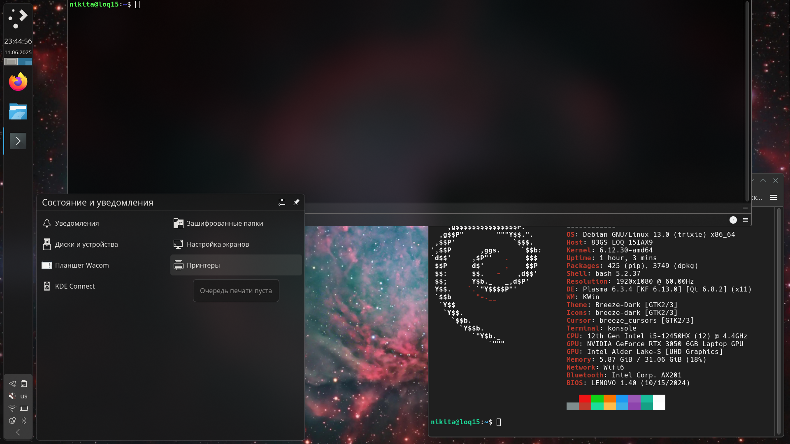

# MyKDE-Themes

Мои темы для оформления рабочей среды KDE Plasma 5

Включает:

1. тему рабочего стола __MyBreeze__ с парящими менющаками, скопировать папку с темой в `~/.local/share/plasma/desktoptheme/`

2. тему Yakuake __MyYakuakeMenu__, адаптированную для прозрачности с эффектом размытия, рекомендуется включить настройку Blur=true в `[Appearance]` в конфиге `~/.config/yakuakerc`, скопировать папку с темой в `~/.local/share/yakuake/kns_skins/`

3. цветовую схему __MyBreeze.colors__ с выпиленными оттенками синего в тёмных тонах что бы не так болели глаза, можно установить из файла в Праметры->Внешний вид->Цветовые схемы

4. профили `MyDark.profile` для konsole и `MyDarkBlur.profile` с прозрачностью для Yakuake, шрифты увеличенны до 14 иначе мне просто тяжело воспринимать

